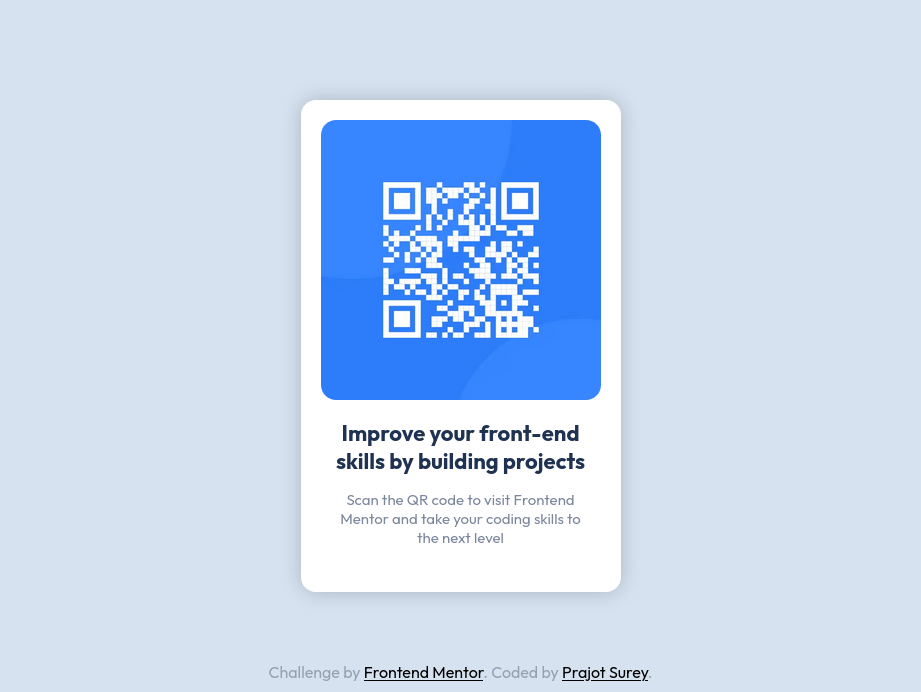

# Frontend Mentor - QR code component solution

This is a solution to the [QR code component challenge on Frontend Mentor](https://www.frontendmentor.io/challenges/qr-code-component-iux_sIO_H). Frontend Mentor challenges help you improve your coding skills by building realistic projects. 

## Table of contents

- [Overview](#overview)
  - [Screenshot](#screenshot)
  - [Links](#links)
- [My process](#my-process)
  - [Built with](#built-with)
  - [What I learned](#what-i-learned)
  - [Useful resources](#useful-resources)
- [Author](#author)

## Overview

This project is built with NextJs and SASS. It is deployed on vercel.

### Screenshot

### Links

- Solution URL: [Add solution URL here](https://your-solution-url.com)
- Live Site URL: [Add live site URL here](https://your-live-site-url.com)

## My process

### Built with

- Semantic HTML5 markup
- CSS custom properties
- CSS Grid
- [Next.js](https://nextjs.org/) - React framework
- [SASS](https://styled-components.com/) - For styles

### What I learned

I learned the basics of SASS by using it with NextJS.

### Continued development

Use this section to outline areas that you want to continue focusing on in future projects. These could be concepts you're still not completely comfortable with or techniques you found useful that you want to refine and perfect.

**Note: Delete this note and the content within this section and replace with your own plans for continued development.**

### Useful resources

- [NextJs SASS boilerplate example](https://github.com/vercel/next.js/tree/canary/examples/with-next-sass) - This is the boilerplate example for using NextJs with SASS. I used this to set up my project.

## Author

- Website - [Prajot Surey](https://www.prajot.dev)
- Frontend Mentor - [@prajtosurey](https://www.frontendmentor.io/profile/prajotsurey)
- Twitter - [@prajotsurey0](https://www.twitter.com/prajotsurey0)

